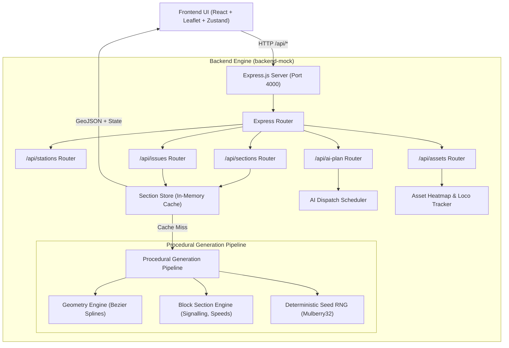

# 🚂 Indian Railways AI-Powered Automatic Block Planning — Dynamic Mock Backend

> **SIH Problem Statement SIH26027**: *AI-Powered Automatic Block Planning to Maximize Asset Availability for Train Operations on Indian Railways*

An Express.js + TypeScript mock backend service providing procedural track geometry generation, 4-aspect automatic block section modeling, dynamic AI train dispatch scheduling, and rolling stock asset availability heatmaps for **ANY station pair across Indian Railways**.

---

## 📑 Table of Contents

1. [System Architecture](#-system-architecture)
2. [Key Capabilities](#-key-capabilities)
3. [Procedural Generation Engine](#-procedural-generation-engine)
   - [Great-Circle & Railway Distance Calculation](#1-distance-calculation)
   - [Realistic Curved Track Geometry (Cubic Bezier Spline)](#2-track-geometry-spline-interpolation)
   - [Block Slicing & Signalling Nomenclature](#3-block-slicing--signalling-rules)
   - [Deterministic Pseudo-Random Seeding](#4-deterministic-pseudo-random-seeding)
4. [Data Schemas & Types](#-data-schemas--types)
   - [Station Schema](#1-station-schema)
   - [Block Section GeoJSON Schema](#2-block-section-geojson-schema)
   - [Issue & Telemetry Schema](#3-issue--telemetry-schema)
   - [AI Dispatch Plan Schema](#4-ai-dispatch-plan-schema)
   - [Asset Utilization Schema](#5-asset-utilization-schema)
5. [Complete REST API Reference](#-complete-rest-api-reference)
   - [`GET /api/health`](#get-apihealth)
   - [`GET /api/stations`](#get-apistations)
   - [`GET /api/stations/:code`](#get-apistationscode)
   - [`GET /api/stations/meta/corridors`](#get-apistationsmetacorridors)
   - [`GET /api/sections`](#get-apisections)
   - [`GET /api/ai-plan`](#get-apiai-plan)
   - [`GET /api/assets`](#get-apiassets)
   - [`POST /api/issues`](#post-apiissues)
   - [`DELETE /api/issues/:issueId`](#delete-apiissuesissueid)
   - [`GET /api/issues/blocks/:blockId`](#get-apiissuesblocksblockid)
6. [Stateful In-Memory Store](#-stateful-in-memory-store)
7. [Getting Started & Installation](#-getting-started--installation)
8. [Frontend Integration Guide](#-frontend-integration-guide)

---

## 🏛️ System Architecture



---

## ✨ Key Capabilities

1. **Infinite Any-Station Routing**: Unlike hardcoded mock files with only 2–3 fixed corridors, this backend dynamically synthesizes real-looking railway corridors between **any two stations in India** (e.g., `NDLS → BSB`, `HWH → MAS`, `CSMT → PNBE`, `SBC → HYB`, etc.).
2. **True GeoJSON Standard Compliance**: Generates valid `FeatureCollection` with `LineString` coordinate geometries formatted in `[longitude, latitude]` for immediate consumption by Leaflet, OpenLayers, MapLibre, or Mapbox.
3. **Realistic 4-Aspect Railway Signalling**: Generates sequenced Automatic Block Signalling (`ABS-[STN]-[SEQ]UP`), realistic gradients, block lengths ($1000\text{m} - 1800\text{m}$), and maximum permissible speed limits ($110 - 160\text{ km/h}$).
4. **Stateful In-Memory Mutations**: Adding an issue (`POST /api/issues`) updates the block's live issue array in memory, so subsequent requests or resolves (`DELETE /api/issues/:issueId`) stay synchronized across clients.
5. **Multi-Mode Support**:
   - **Report Mode**: Multi-issue telemetry (Signal fault, Speed restriction, Maintenance, Obstruction).
   - **AI Plan Mode**: Time-sequenced train slots, priority tiers (`Premier`, `Express`, `Freight`), headways, and speeds.
   - **Asset View Mode**: Real-time rolling stock tracking (WAP-7, WAG-9, Vande Bharat rakes) and idle-time heatmaps.

---

## 🧮 Procedural Generation Engine

### 1. Distance Calculation
For any station pair $(A, B)$ with coordinates $(\text{lat}_1, \text{lng}_1)$ and $(\text{lat}_2, \text{lng}_2)$, the great-circle distance $d$ is computed via the Haversine formula:

$$\Delta\phi = \frac{(\text{lat}_2 - \text{lat}_1)\pi}{180}, \quad \Delta\lambda = \frac{(\text{lng}_2 - \text{lng}_1)\pi}{180}$$
$$a = \sin^2\left(\frac{\Delta\phi}{2}\right) + \cos(\text{lat}_1)\cos(\text{lat}_2)\sin^2\left(\frac{\Delta\lambda}{2}\right)$$
$$c = 2 \cdot \arctan2(\sqrt{a}, \sqrt{1-a}), \quad d = R \cdot c \quad (R = 6371\text{ km})$$

Because railway tracks navigate physical terrain, curves, and elevation, the operational rail distance is scaled:
$$D_{\text{rail}} \approx 1.18 \times d$$

The total number of block sections $N$ is derived as:
$$N = \text{clamp}\left(\left\lfloor \frac{D_{\text{rail}}}{14} \right\rfloor, 16, 32\right)$$

### 2. Track Geometry (Spline Interpolation)
To avoid artificial straight lines, the engine constructs a smooth **cubic Bezier spline**:
- Let $P_0 = (\text{lng}_1, \text{lat}_1)$ and $P_3 = (\text{lng}_2, \text{lat}_2)$.
- Let $(\hat{n}_x, \hat{n}_y)$ be the perpendicular unit normal vector to vector $\vec{P_0 P_3}$.
- Control points $P_1$ and $P_2$ are placed at $\frac{1}{3}$ and $\frac{2}{3}$ along the baseline with subtle deterministic lateral offsets:
  $$P_1 = P_0 + \frac{1}{3}\vec{P_0 P_3} + k_1 \cdot \|\vec{P_0 P_3}\| \cdot \hat{n}$$
  $$P_2 = P_0 + \frac{2}{3}\vec{P_0 P_3} + k_2 \cdot \|\vec{P_0 P_3}\| \cdot \hat{n}$$
- The curve is sampled at $M = 4N$ points using:
  $$B(t) = (1-t)^3 P_0 + 3(1-t)^2 t P_1 + 3(1-t)t^2 P_2 + t^3 P_3, \quad t \in [0, 1]$$

### 3. Block Slicing & Signalling Rules
The continuous polyline $B(t)$ is partitioned into $N$ contiguous segments. Each segment forms a GeoJSON `Feature` with:
- **Block ID**: `[FROM]-[TO]-BLK-01`, `[FROM]-[TO]-BLK-02`, etc.
- **Signals**: `ABS-[FROM]-100UP` $\to$ `ABS-[FROM]-102UP` $\to$ `ABS-[FROM]-104UP`.
- **Length**: $1000\text{m} - 1800\text{m}$.
- **Gradients**: `Level`, `1 in 200 Rising`, `1 in 150 Falling`, `1 in 300 Rising`.

### 4. Deterministic Pseudo-Random Seeding
Using the **Mulberry32 PRNG** initialized with `hashString("FROM-TO")`:
- Requesting the same corridor (`NDLS → AGC`) always returns the exact same track geometry and initial telemetry on fresh server restart.
- Different pairs produce uniquely contoured tracks matching their geography.

---

## 📋 Data Schemas & Types

### 1. Station Schema
```typescript
interface Station {
  code: string;       // e.g. "NDLS"
  name: string;       // e.g. "New Delhi"
  division?: string;  // e.g. "Delhi"
  state: string;      // e.g. "Delhi"
  zone: string;       // e.g. "NR"
  lat: number;        // e.g. 28.6143
  lng: number;        // e.g. 77.2189
  isHub?: boolean;    // true for major junctions
}
```

### 2. Block Section GeoJSON Schema
```typescript
interface BlockFeatureCollection {
  type: "FeatureCollection";
  features: BlockFeature[];
}

interface BlockFeature {
  type: "Feature";
  geometry: {
    type: "LineString";
    coordinates: [number, number][]; // [[lng1, lat1], [lng2, lat2], ...]
  };
  properties: BlockProperties;
}

interface BlockProperties {
  block_id: string;             // e.g. "NDLS-AGC-BLK-01"
  sequence: number;             // 0, 1, 2...
  start_signal: string;         // e.g. "ABS-NDLS-100UP"
  end_signal: string;           // e.g. "ABS-NDLS-102UP"
  occupancy: "free" | "occupied" | "reserved";
  issues: BlockIssue[];         // zero or more simultaneous issues
  train_id?: string;            // e.g. "22436" (if occupied)
  train_name?: string;          // e.g. "Vande Bharat Express"
  length_m: number;             // e.g. 1400
  max_speed_kmh?: number;       // e.g. 130
  gradient?: string;            // e.g. "1 in 200 Rising"
}
```

### 3. Issue & Telemetry Schema
```typescript
interface BlockIssue {
  issue_id: string;             // e.g. "ISSUE-1724950000000-842"
  issue_type: "obstruction" | "signal_fault" | "speed_restriction" | "maintenance" | "other";
  description: string;          // Human-readable detail
  severity: "low" | "medium" | "high";
  reported_by: string;          // e.g. "Section Controller"
  timestamp: string;            // ISO 8601 UTC
}
```

#### Derived Status Calculation (Frontend & Analytics Matrix)
| Issues Count & Max Severity | Base Occupancy | Derived Status | Color Hex (Dark Mode) |
|---|---|---|---|
| 1+ issues, severity = `high` (or `signal_fault` / `obstruction`) | Any | `fault` | `#ff453a` (Crimson Red) |
| 1+ issues, severity = `medium` / `low` (`speed_restriction`) | Any | `degraded` | `#ffd60a` (Amber Yellow) |
| 0 issues | `occupied` | `occupied` | `#2997ff` (Action Blue) |
| 0 issues | `reserved` | `reserved` | `#bf5af2` (Violet) |
| 0 issues | `free` | `free` | `#30d158` (Signal Green) |

---

### 4. AI Dispatch Plan Schema
```typescript
interface AiPlanBlock {
  block_id: string;             // e.g. "NDLS-AGC-BLK-04"
  train_id: string;             // e.g. "12002"
  train_name?: string;          // e.g. "Bhopal Shatabdi Express"
  entry_time: string;           // ISO 8601 UTC
  exit_time: string;            // ISO 8601 UTC
  planned_speed_kmh?: number;   // e.g. 135
  headway_seconds?: number;     // e.g. 240
  priority_tier?: "Premier" | "Express" | "Freight";
}
```

---

### 5. Asset Utilization Schema
```typescript
interface AssetBlock {
  block_id: string;             // e.g. "NDLS-AGC-BLK-07"
  idle_minutes: number;         // 0 to 180+
  asset_id: string;             // e.g. "WAP7-30452"
  asset_type?: "Electric Loco (WAP-7)" | "Diesel Loco (WDM-3D)" | "EMU / Vande Bharat" | "Freight Rake";
  asset_status?: "Holding at Signal" | "Optimal Transit" | "Speed Restricted" | "Yard Staging";
}
```

---

## 📡 Complete REST API Reference

Base URL: `http://localhost:4000/api`

### `GET /api/health`
Health check and system uptime.
```bash
curl http://localhost:4000/api/health
```
```json
{
  "status": "ok",
  "timestamp": "2026-08-29T17:30:00.000Z",
  "uptime": 124.5,
  "memoryUsage": { "rss": 42100000, "heapTotal": 21000000, "heapUsed": 15000000 }
}
```

---

### `GET /api/stations`
Retrieve list of Indian Railway stations with optional search and zone filters.

**Query Parameters:**
- `q` *(optional)*: Search query matching station code, name, or state.
- `zone` *(optional)*: Filter by railway zone (e.g. `NR`, `NCR`, `WR`, `SR`, `SWR`).

```bash
curl "http://localhost:4000/api/stations?q=Delhi"
```
```json
{
  "success": true,
  "total": 4,
  "data": [
    {
      "code": "NDLS",
      "name": "New Delhi",
      "division": "Delhi",
      "state": "Delhi",
      "zone": "NR",
      "lat": 28.6143,
      "lng": 77.2189,
      "isHub": true
    }
  ]
}
```

---

### `GET /api/stations/:code`
Retrieve a single station by code.
```bash
curl http://localhost:4000/api/stations/NDLS
```

---

### `GET /api/stations/meta/corridors`
Retrieve preset high-density corridors for quick selection.
```bash
curl http://localhost:4000/api/stations/meta/corridors
```

---

### `GET /api/sections`
Generates or retrieves the complete GeoJSON automatic block sections for **any station pair**.

**Query Parameters:**
- `from` *(required)*: Origin station code (e.g. `NDLS`).
- `to` *(required)*: Destination station code (e.g. `AGC` or `BSB` or `CSMT`).

```bash
curl "http://localhost:4000/api/sections?from=NDLS&to=AGC"
```
```json
{
  "success": true,
  "meta": {
    "from": { "code": "NDLS", "name": "New Delhi", "lat": 28.6143, "lng": 77.2189 },
    "to": { "code": "AGC", "name": "Agra Cantt", "lat": 27.1591, "lng": 77.9944 },
    "distance_km": 195,
    "total_blocks": 20
  },
  "data": {
    "type": "FeatureCollection",
    "features": [
      {
        "type": "Feature",
        "geometry": {
          "type": "LineString",
          "coordinates": [[77.2189, 28.6143], [77.2512, 28.5320], [77.2891, 28.4501]]
        },
        "properties": {
          "block_id": "NDLS-AGC-BLK-01",
          "sequence": 0,
          "start_signal": "ABS-NDLS-100UP",
          "end_signal": "ABS-NDLS-102UP",
          "occupancy": "free",
          "issues": [],
          "length_m": 1400,
          "max_speed_kmh": 140,
          "gradient": "Level"
        }
      }
    ]
  }
}
```

---

### `GET /api/ai-plan`
Returns AI train dispatch schedules for all blocks along a corridor.

**Query Parameters:**
- `from` & `to` *(required)*: e.g. `?from=NDLS&to=AGC`

```bash
curl "http://localhost:4000/api/ai-plan?from=NDLS&to=AGC"
```
```json
{
  "success": true,
  "corridor": "NDLS-AGC",
  "total_planned_blocks": 20,
  "data": {
    "NDLS-AGC-BLK-01": {
      "block_id": "NDLS-AGC-BLK-01",
      "train_id": "22436",
      "train_name": "Vande Bharat Express",
      "entry_time": "2026-08-29T17:35:00.000Z",
      "exit_time": "2026-08-29T17:38:00.000Z",
      "planned_speed_kmh": 140,
      "headway_seconds": 240,
      "priority_tier": "Premier"
    }
  }
}
```

---

### `GET /api/assets`
Returns asset idle duration heatmaps and locomotive tracking metrics for all blocks along a corridor.

**Query Parameters:**
- `from` & `to` *(required)*: e.g. `?from=NDLS&to=AGC`

```bash
curl "http://localhost:4000/api/assets?from=NDLS&to=AGC"
```
```json
{
  "success": true,
  "corridor": "NDLS-AGC",
  "total_tracked_assets": 20,
  "data": {
    "NDLS-AGC-BLK-01": {
      "block_id": "NDLS-AGC-BLK-01",
      "idle_minutes": 8,
      "asset_id": "WAP7-30812",
      "asset_type": "Electric Loco (WAP-7)",
      "asset_status": "Optimal Transit"
    }
  }
}
```

---

### `POST /api/issues`
Report a new telemetry, signal, or maintenance issue on any block.

**Request Body:**
```json
{
  "block_id": "NDLS-AGC-BLK-05",
  "issue_type": "speed_restriction",
  "description": "Emergency track packing work: 20 km/h caution order active",
  "severity": "medium",
  "reported_by": "P-WAY Gang #4",
  "timestamp": "2026-08-29T17:40:00.000Z"
}
```

```bash
curl -X POST http://localhost:4000/api/issues \
  -H "Content-Type: application/json" \
  -d '{
    "block_id": "NDLS-AGC-BLK-05",
    "issue_type": "speed_restriction",
    "description": "Emergency track packing work: 20 km/h caution order active",
    "severity": "medium",
    "reported_by": "P-WAY Gang #4",
    "timestamp": "2026-08-29T17:40:00.000Z"
  }'
```

**Response (201 Created):**
```json
{
  "success": true,
  "issue_id": "ISSUE-1724950400000-4821",
  "timestamp": "2026-08-29T17:40:00.000Z",
  "data": {
    "issue_id": "ISSUE-1724950400000-4821",
    "issue_type": "speed_restriction",
    "description": "Emergency track packing work: 20 km/h caution order active",
    "severity": "medium",
    "reported_by": "P-WAY Gang #4",
    "timestamp": "2026-08-29T17:40:00.000Z"
  }
}
```

---

### `DELETE /api/issues/:issueId`
Resolve and dismiss an issue from a block.

```bash
curl -X DELETE "http://localhost:4000/api/issues/ISSUE-1724950400000-4821"
```
```json
{
  "success": true,
  "message": "Issue 'ISSUE-1724950400000-4821' resolved successfully",
  "resolvedCount": 1
}
```

---

### `GET /api/issues/blocks/:blockId`
Inspect live status and all active issues on a single block.
```bash
curl http://localhost:4000/api/issues/blocks/NDLS-AGC-BLK-05
```

---

## 💾 Stateful In-Memory Store

The backend utilizes `SectionStore` (`src/services/sectionStore.ts`) to manage live state:
- **Corridor Caching**: The first time a corridor is queried (e.g. `NDLS -> GKP`), the spline and block collection are computed and cached in a `Map<string, BlockFeatureCollection>`.
- **Live Issue Mutations**: When a new issue is submitted via `POST /api/issues`, the issue is prepended to `properties.issues`.
- **Live Issue Resolutions**: When an issue is resolved via `DELETE /api/issues/:issueId`, it is stripped from the block's array.
- Subsequent calls to `GET /api/sections?from=NDLS&to=GKP` immediately return the updated state.

---

## 🚀 Getting Started & Installation

### Prerequisites
- Node.js 18.0+
- npm 9.0+

### Installation & Run

```bash
# Navigate to the mock backend folder
cd backend-mock

# Install dependencies
npm install

# Start in development mode with live hot-reloading (tsx)
npm run dev

# Or build and run for production
npm run build
npm start
```

Default port is `4000`. You can configure a custom port via `.env`:
```env
PORT=4000
```

---

## 🔗 Frontend Integration Guide

The frontend application (`frontend/src/services/api.ts`) communicates directly with this mock backend:

1. **Environment Configuration**: Set `VITE_API_URL` in `frontend/.env`:
   ```env
   VITE_API_URL=http://localhost:4000/api
   ```
2. **Dynamic Fallback**: If the mock backend is not running, the frontend gracefully falls back to local procedural mock generation so development is never blocked.
3. **Plugging a Real Backend Later**: To connect a production backend (e.g. Python FastAPI, Java Spring Boot, Go), simply point `VITE_API_URL` to your production API endpoint. Because all JSON schemas and contracts match this specification 1-to-1, zero frontend UI code changes are needed.

